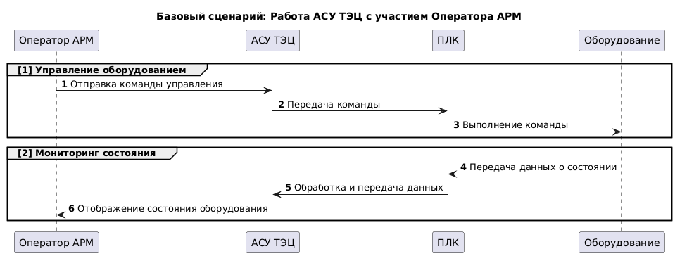
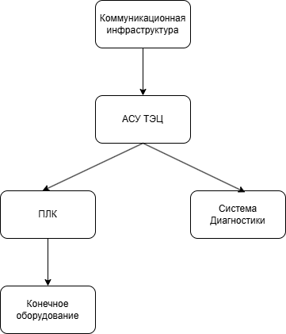
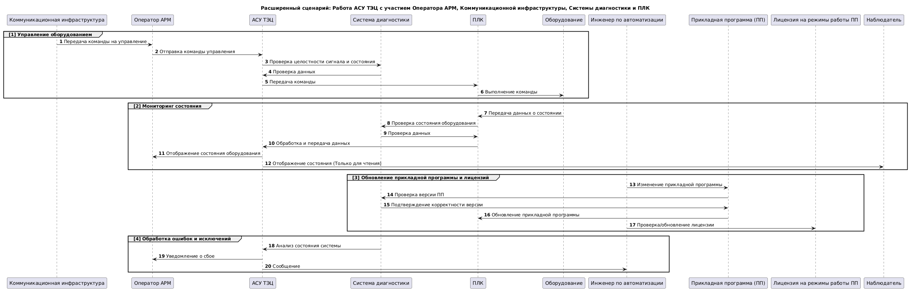
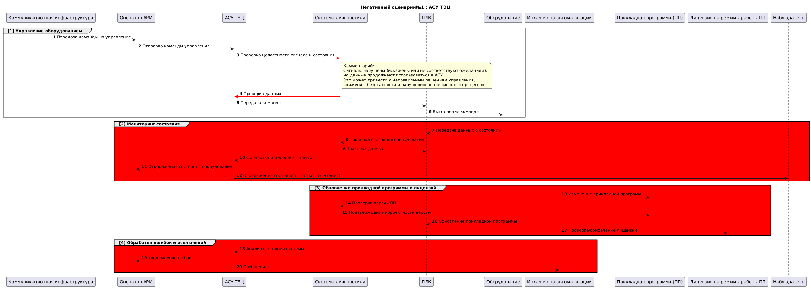
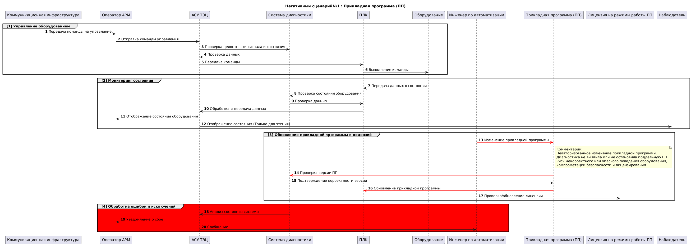
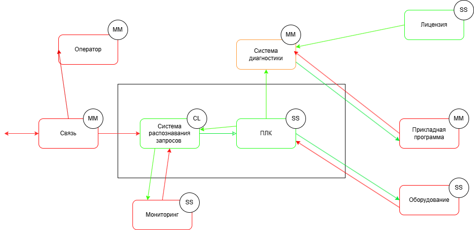
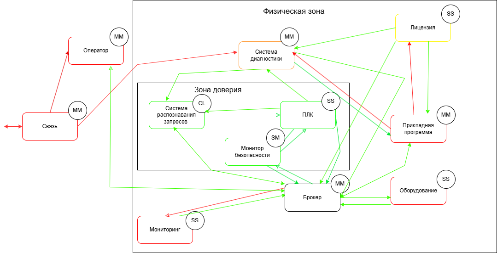

# Автоматизированная система управления (АСУ) ТЭЦ

## Краткое описание проектируемой системы

Продукт - программируемый логический контроплер, обеспечивающий взаимодействие автоматизированной системы управления технологическим процессом (АСУ ТП) с конечным оборудованием.

Автоматизированная система управления (АСУ) ТЭЦ обрабатывает сигналы от оборудования, управляет им по правилам, с параметрами, уникальными для каждой станции, через
программируемые погические контроплеры (ПЛК), связанные с оборудованием, или датчики, передавая в АСУ данные, а команды от АСУ - в исполнительные устройства.

Контроллер выполняет управление техн. оборудованием по прикладной программе, написанной инженером-разработчиком.
Прикладная программа работает поверх системного ПО. Для обеспечения необходимой гибкости наладки и реализации технических процессов прикладная программа может
свободно меняться квалифицированным персоналом без необходимости изменения системного ПО.

## Негативные события

| Ценность | Нежелательные события |
|----------|-----------------------|
| Данные, которые получает и передаёт ПЛК | Подмена сигнала;  Ошибка обработки сигнала;  Нарушение доступности|   
| Команды для оборудования | Команды нет, когда нужно; Команда есть, когда не нужно | 
| Прикладная программа (ПП) инженера-разработчика | Использована неаутентичная ПП; Неавторизованный доступ к коду ПП | 
| Лицензия на режимы работы ПП | Использование неаутентичной лицензии | Неавторизованный доступ к данным лицензии | 

## Роли пользователей

| Роль | Назначение | 
|----------|-----------------------|
| Оператор АРМ | Пользуется данными ПЛК. Отправляет сигналы на оборудование. Может менять уставки (донастраивать ПП) | 
| Инженер по автоматизации | Может изменить ПП и обновить его на ПЛК | 
| Наблюдатель | Имеет доступ к данным мониторинга в режиме только для чтения | 

## Основные функциональные сценарии

## Высокоуровневая архитектура

## Описание подсистем
|Название подсистемы |Назначение
|----------|-----------------------|
|Коммуникационная инфраструктураавляет сигналы на оборудование. Может менять уставки (донастраивать ПП) |Обеспечивает безопасную и надёжную передачу данных между АСУ ТП и внешними системами.
| АСУ ТЭЦ|Обрабатывает управляющие сигналы, формирует команды, взаимодействует с ПЛК и диагностикой.
| ПЛК | Центр локального управления. Выполняет команды, собирает данные, выполняет прикладную программу
Система диагностики | Контролирует целостность сигналов, версию ПП, статус лицензии, состояние оборудования.
Конечное оборудование | Физические устройства (насосы, клапаны, датчики и т.п.), управляющиеся ПЛК.
## Расширенные диаграммы функциональных сценариев

## Цели и предположения безопасности

#### Цели безопасности
1. ПЛК принимает команды только от доверенных систем, по разрешённым каналам связи, в заданное время, с проверкой целостности, актуальности и контекста.
2. Данные, поступающие в ПЛК, используются только при подтверждённой целостности и аутентичности источника.
3. АСУ обрабатывает команды к оборудованию только от проверенных источников. Команды от неаутентифицированных источников или с признаками подмены блокируются.
4. Доступ к ПП и лицензиям возможен только через доверенные инструменты с назначенными ролями.
5. Изменения в прикладной программе (ПП) и её лицензиях могут вносить только авторизованные сотрудники с использованием доверенных инструментов и обязательной аутентификацией.

#### Предположения безопасности
1. Злоумышленник не имеет физического доступа к ПЛК, сетевым интерфейсам и инженерным портам.
2. Система функционирует в изолированной сети, за исключением заранее определённых защищённых каналов связи.
3. Все команды управления поступают только по доверенным каналам и выполняются в допустимом контексте.
4. Все пользователи с правами изменения ПП проходят строгую аутентификацию и работают в рамках назначенных ролей.
5. Редактирование ПП и лицензий возможно только с доверенных рабочих станций в защищённой сети.
   
### Таблица соотнесения ценностей, неприемлемых событий и целей безопасности
| Ценность |Негативные собитие | Оценка учерба | Цель безопасности
|----------|-----------------------|-------------|-------|
| Данные, которые получает и передаёт ПЛК | Нарушение целостности (сигнал изменён) |Высокий | 3|
|  | Нарушение достоверности сигнала |Средний | 3
|  | Сигнал не обработан (пришёл и пропал) |Высокий | 4|
|  | Нарушение доступности|Высокий | 4|
| Команды для оборудования | Команды нет, когда нужно |Высокий | 4|
| | Команда есть, когда не нужно |Средний | 2|
| Прикладная программа (ПП) инженера-разработчика | Использована неаутентичная ПП |Средний | 1|
|| Неавторизованный доступ к коду ПП |Высокий | 5|
| Лицензия на режимы работы ПП | Использование неаутентичной лицензии |Средний | 1|
| | Неавторизованный доступ к данным лицензии |Средний | 5|
## Негативные сценарии

 ## Политика Архитектуры
 #### Версия 1
 
 |Домен безопасности | Уровень доверия|Оценка сложности и размера домена| Обоснование
|--------|----------|-----------------------|-------------|
| Коммуникационная инфраструктура(связь)| Недоверенный|MM|Передаёт команды и данные, может быть скомпрометирован, ЦБ защищается ПЛК |
| Система рапознавания запросов(АСУ)|Доверенный|CL|Центр логики и контроля; проверяет входящие сигналы, повышая доверие.|
| ПЛК| 	Доверенный|SS| Собственная разработка, известная архитектура, ограниченный функционал, физически защищён
| Система диагностики |Доверенный, повышающая целостность |MM| Выполняет контроль, сложно подделать, не влияет напрямую на управление|
|Оборудование|Недоверенный |SS | Могут быть неисправности, но ответственность за достоверность лежит на ПЛК.
|Прикладная программа (ПП)|Недоверенный|MM |	Получена извне, изменяема, нет механизмов контроля подлинности
|Лицензия на режимы ПП|Доверенный|SS |Простая реализация, проверяет режимы, но пока без криптографической верификации
|Оператор АРМ|Недоверенный|MM |	Управляется человеком, возможны ошибки или саботаж
|Мониторинг|Недоверенный|SS|	Только читает данные, не проверяется на подлинность, возможна подмена

 #### Версия 2
 
 |Домен безопасности | Уровень доверия|Оценка сложности и размера домена| Обоснование
|--------|----------|-----------------------|-------------|
| Коммуникационная инфраструктура (связь)| Недоверенный|MM|Передаёт команды и данные, может быть скомпрометирован, ЦБ защищается ПЛК |
| Система рапознавания запросов(АСУ)|Доверенный|CL|Центр логики и контроля; проверяет входящие сигналы, повышая доверие.|
| ПЛК| 	Доверенный|SS| Собственная разработка, известная архитектура, ограниченный функционал, физически защищён
| Система диагностики |Доверенный, повышающая целостность |MM| Выполняет контроль, сложно подделать, не влияет напрямую на управление|
|Оборудование|Недоверенный |SS | Могут быть неисправности, но ответственность за достоверность лежит на ПЛК.
|Прикладная программа (ПП)|Доверенный, повышающая целостность|MM |	Проходит верификацию на ПЛК, защищена от внедрения вредоносного кода
|Лицензия на режимы ПП|Доверенный, повышающая целостность|SS |Верифицируется системой, невозможно подделать без криптографического ключа
|Оператор АРМ|Недоверенный|MM |	Управляется человеком, возможны ошибки или саботаж
|Наблюдатель|Недоверенный|SS|	Только читает данные, не проверяется на подлинность, возможна подмена
|Система верификации ПП и лицензий| Доверенный, повышающая целостность|MM|	Проверяет подлинность ПО и лицензий с использованием криптографии, исключает подмену, устойчива к атаке

 #### Политика Безопасности

#### Реализованная политика безопасности в коде
import base64

VERIFIER_SEAL = "verifier_seal"
LICENSE_SIGNATURE = "license_signature"

def check_operation(id, details):
    authorized = False

    src = details["source"]
    dst = details["destination"]
    operation = details["operation"]

    if dst == 'comm_infra':
        authorized = True

    if src == 'comm_infra' and dst == 'message_broker':
        authorized = True

    if src == 'comm_infra' and dst == 'asu_teс':
        authorized = True
    if src == 'comm_infra' and dst == 'operator_arm':
        authorized = True
    if src == 'operator_arm' and dst == 'message_broker': 
        authorized = True 
    if src == 'message_broker' and dst == 'operator_arm': 
        authorized = True 
    if src == 'message_broker' and dst == 'asu_teс' \
            and operation == 'control_command_from_operator':
        authorized = True  
    if src == 'asu_teс' and dst == 'message_broker': 
        authorized = True
    if src == 'operator_arm' and dst == 'asu_teс':
        authorized = True
    if src == 'asu_teс' and dst == 'plc' \
            and operation == 'validated_command_from_asu':
        authorized = True
    if src == 'plc' and dst == 'message_broker':
        authorized = True
    if src == 'message_broker' and dst == 'plc':
        authorized = True
  
    if src == 'plc' and dst == 'equipment' \
            and operation == 'execute_command':
        authorized = True

    if src == 'equipment' and dst == 'message_broker': 
        authorized = True
    if src == 'message_broker' and dst == 'equipment': 
        authorized = True

    if src == 'equipment' and dst == 'plc' \
            and operation == 'equipment_status_update':
        authorized = True

    if src == 'plc' and dst == 'asu_teс' \
            and operation == 'status_to_asu':
        authorized = True
    if src == 'asu_teс' and dst == 'operator_arm' \
            and operation == 'status_display':
        authorized = True
    if src == 'plc' and dst == 'diagnostic_system' \
            and operation == 'plc_diagnostic_data':
        authorized = True

    if src == 'diagnostic_system' and dst == 'message_broker': 
        authorized = True

    if src == 'message_broker' and dst == 'diagnostic_system': 
        authorized = True

    if src == 'diagnostic_system' and dst == 'asu_teс' \
            and operation == 'diagnostic_to_asu':
        authorized = True
    if src == 'asu_teс' and dst == 'automation_engineer' \
            and operation == 'asu_to_engineer_update':
        authorized = True

    if src == 'automation_engineer' and dst == 'message_broker': 
        authorized = True

    if src == 'message_broker' and dst == 'automation_engineer': 
        authorized = True
    if src == 'app_program' and dst == 'license_for_mode' \
            and operation == 'request_license_validation':
        authorized = True

    if src == 'verification_system' and dst == 'app_program' \
            and operation == 'verification_result':
        authorized = True
    if src == 'message_broker' and dst == 'verification_system' \
            and operation == 'verify_app_update':
        authorized = True 
    if src == 'verification_system' and dst == 'message_broker': 
        authorized = True

    if src == 'verification_system' and dst == 'diagnostic_system' \
            and operation == 'verification_status_to_diagnostics':
        authorized = True
    if src == 'verification_system' and dst == 'license_for_mode' \
            and operation == 'license_check_request':
        authorized = True

    if src == 'message_broker' and dst == 'license_for_mode' \
            and operation == 'verify_license_for_mode':
        authorized = True

    if src == 'license_for_mode' and dst == 'app_program' \
            and operation == 'license_confirmed':
        authorized = True

    if src == 'license_for_mode' and dst == 'message_broker': 
        authorized = True

    if src == 'message_broker' and dst == 'license_for_mode': 
        authorized = True

    if src == 'license_for_mode' and dst == 'diagnostic_system' \
            and operation == 'license_status_to_diagnostics':
        authorized = True

    if src == 'message_broker' and dst == 'security_monitor' \
            and operation == 'collect_security_data':
        authorized = True

    if src == 'security_monitor' and dst == 'message_broker' \
            and operation == 'report_security_status':
        authorized = True
    
    return authorized

def check_payload_seal(payload):
    try:
        p = base64.b64decode(payload).decode()
        if p.endswith(VERIFIER_SEAL) or p.endswith(LICENSE_SIGNATURE):
            print('[info] payload seal is valid')
            return True
    except Exception as e:
        print(f'[error] seal check error: {e}')
    return False
